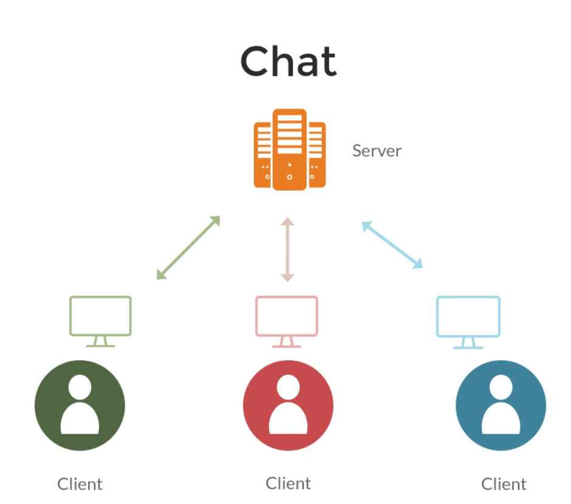

<br/>
<p align="center">
  <a href="https://github.com/rain-ho/eigenfaces">
    
  </a>
  <h3 align="center">Python Secure Chat
</h3>

  <p align="center">
    Chat with censored words
    <br/>
    <br/>
    <a href="https://github.com/rain-ho/secure-chat"><strong>Explore the docs »</strong></a>
    <br/>
    <br/>
    <a href="https://github.com/rain-ho/secure-chat">View Demo</a>
    .
    <a href="https://github.com/rain-ho/secure-chat/issues">Issues</a>
    .
    <a href="https://github.com/rain-ho/secure-chat/discussions">Discussions</a>
  </p>
</p>

## Table Of Contents

* [About the Project](#about-the-project)
* [Getting Started](#getting-started)
  * [Prerequisites](#prerequisites)
  * [Installation](#installation)
* [Usage](#usage)
  * [Message Censorship](#message-censorship)
* [Contributing](#contributing)
* [Authors](#authors)

## About The Project


This chat program is a simple client-server application designed to allow two users to communicate with each other through the server. The server handles the incoming connections from both clients and relays messages between them. The messages are censored using a list of predefined words to maintain a respectful and appropriate environment for the users.

The program is built using Python and the socket library for network communication. Clients can connect from separate computers over the network and exchange messages with each other in real-time. Messages are checked for any censored words before being sent to the other user, ensuring a friendly and secure chat experience.

The chat program demonstrates how basic client-server communication works and showcases the implementation of word censorship to maintain a safe and respectful communication environment.

## Getting Started

To use this chat program, follow the instructions below:

### Prerequisites

You need to have Python installed on your computer.

### Installation

1. Clone the repository
```sh
git clone https://github.com/your_username_/chat-program.git
```
2. 
* Create a **censored_words.txt** file and input the words you want to censor, with each word on a separate line, written in uppercase.
* Create a **.env** file to store your server's IPv4 address under the name **'YOUR_SERVER_IP'** and your port under **'YOUR_SERVER_PORT'**.

3. Run the server script on one machine
```sh
python server.py
```
4. Run the client scripts on each client machine, providing the server's IP address and the same port number used in the server script
```sh
python client.py <server_ip> <server_port>
```
## Usage
After running the client and server scripts, the two clients can connect to the server and start sending messages to each other. The messages will be relayed through the server to maintain a conversation between the clients.

## Message Censorship
The chat program performs word censorship using a predefined list of censored words. Any message containing these censored words will be replaced with asterisks (*) before being sent to the other user.

## Contributing

Contributions are what make the open source community such an amazing place to be learn, inspire, and create. Any contributions you make are **greatly appreciated**.
* If you have suggestions for adding or removing projects, feel free to [open an issue](https://github.com/rain-ho/secure-chat/issues/new) to discuss it, or directly create a pull request after you edit the *README.md* file with necessary changes.
* Please make sure you check your spelling and grammar.
* Create individual PR for each suggestion.


### Creating A Pull Request

1. Fork the Project
2. Create your Feature Branch
```sh
git checkout -b feature/AmazingFeature
```
3. Commit your Changes
```sh
git commit -m "Added some AmazingFeature" -m "This is the AmazingFeature Description"
```
4. Push to the Branch
```sh
git push origin feature/AmazingFeature
```
5. Open a Pull Request

## Authors

* **[Rafa](https://github.com/rain-ho/)** - *Computer Science Student*
* **[Branco](https://github.com/LuxPT/)** - *Computer Science Student* 